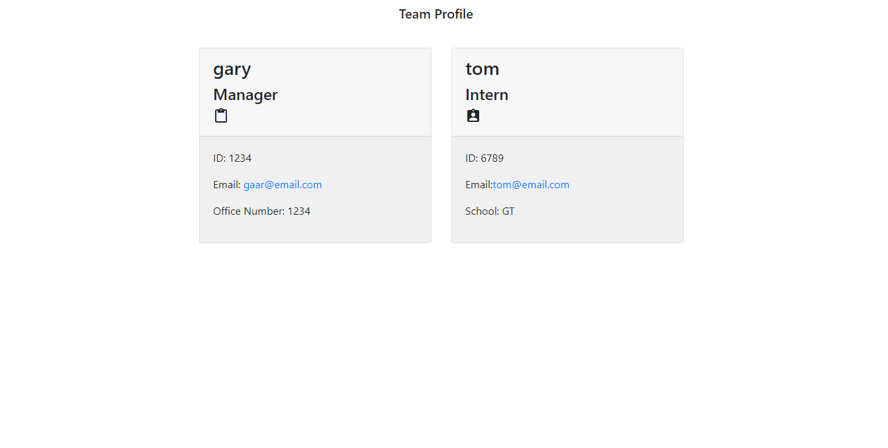

# Module 10 Challenge

## Challenge
The challenge is to build a Node.js command-line application that takes in information about employees on a software engineering team a
nd generates an HTML webpage that displays summaries for each person.

## User Story
AS A manager
I WANT to generate a webpage that displays my team's basic info
SO THAT I have quick access to their emails and GitHub profiles

## Technologies
* Html/Css
* Javascript
* Inquirer Package
* Jest Package 

## Video
[Video Demonstration](https://watch.screencastify.com/v/8azX9ZJMXQsc7fnzrDfH)

## Image
